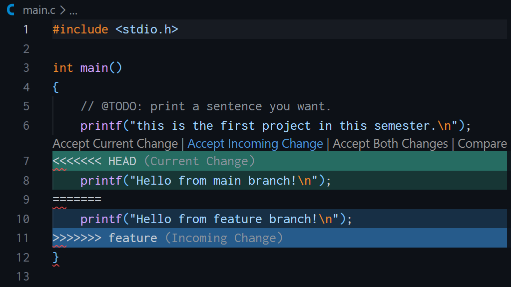
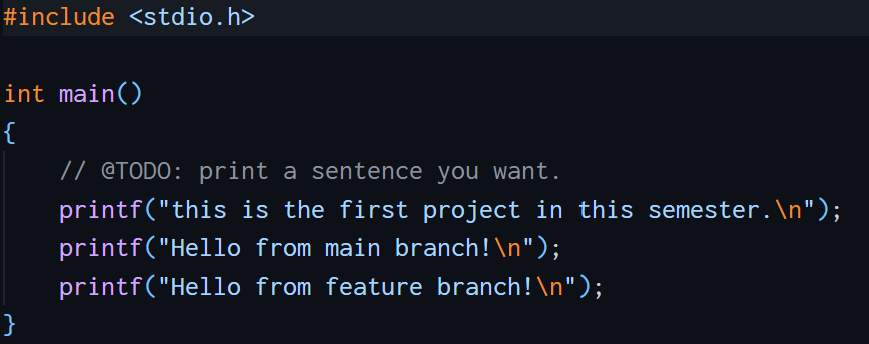

# 实验报告 - 25300680065 周天佑

1. 文档中的问题
    - 有过，使用 Git 进行版本控制，并把仓库放在 GitHub 上。此外也使用过 VS Code Live Share 进行双人同时编辑。协作时通常按照功能或任务分工，每个人在自己的分支上开发，完成后提交并合并到主分支。
    - Git 设计暂存、提交两个步骤，是为让提交内容具有更清晰的边界。暂存区可以从已经修改的文件选择本次要提交的部分，先检查和整理这些内容，再一次性提交。因此，每个 commit 都能对应一个相对独立、完整的功能或修复，便于查看历史、回滚，不会把无关的修改混在一起。
    - `git branch` 默认只显示本地分支；`git branch -a` 则显示所有分支，包括本地分支和远程跟踪分支，例如 `remotes/origin/main`。因此，想查看当前仓库中本地及远程跟踪的全部分支时，应使用 `git branch -a`。

2. 阅读网页并思考“为什么要学习 Git”

   我选择阅读以下两篇文章：

   - [Commit message 和 Change log 编写指南](https://www.ruanyifeng.com/blog/2016/01/commit_message_change_log.html)：这篇文章介绍了规范提交说明的作用和写法。清晰、格式统一的 commit message 可以帮助开发者快速浏览和筛选提交历史，也可以根据提交记录自动生成 Change log。文章重点介绍了 Angular 规范，将提交说明分为 Header、Body 和 Footer，其中 Header 由 `type`、`scope` 和 `subject` 组成，并列举了 `feat`、`fix`、`docs`、`style`、`refactor`、`test`、`chore` 等提交类型。文章还介绍了使用 Commitizen、提交检查工具以及自动生成 Change log 的方法。
   - [Gitflow 使用规范](https://www.dafaycoding.com/article/git-gif-flow)：这篇文章介绍了一个面向团队协作和版本发布的分支管理模型。Gitflow 通常包含长期存在的 `master`（或 `main`）和 `develop` 分支，以及临时的 `feature`、`release` 和 `hotfix` 分支。新功能从 `develop` 创建 feature 分支，开发完成后合并回 develop；准备发布时使用 release 分支进行测试和版本准备；线上出现紧急问题时从生产分支创建 hotfix 分支，修复后再合并回生产和开发分支。这样的分工可以隔离不同阶段的代码，并降低多人协作和版本发布时的风险。

   我认为学习 Git 因为它是组织开发过程，进行版本控制的重要工具。Git 可以记录每次修改，出现问题时能恢复到以前的版本；分支功能可让多人并行开发不同功能，互不影响，最后再通过合并整合代码；远程仓库还方便团队共享代码、进行代码审查和协作。通过规范的提交信息和分支管理，项目历史会更加清晰，开发、测试、发布和维护也会更可靠。所以无论是个人项目还是团队项目，掌握 Git 都能提高开发效率并减少代码丢失和协作冲突。

3. 分支管理与合并冲突

   1. 在 `main` 分支上保留并提交了之前对 `main.c` 的初始修改，提交为 `c8b8999`。
   2. 使用 `git switch -c feature` 创建并切换到 `feature` 分支，将 `main.c` 中的输出修改为 `Hello from feature branch!`，然后提交为 `a827244`。
   3. 切换回 `main` 分支，将同一行修改为 `Hello from main branch!`，然后提交为 `2acb659`。
   4. 在 `main` 分支执行 `git merge feature`。由于两个分支从同一个 base 出发并修改了同一行，Git 报告 `CONFLICT (content): Merge conflict in main.c`。

      合并冲突状态如下：

      

   5. 手动编辑 `main.c`，保留两个分支的有效输出语句并删除冲突标记；随后执行 `git add main.c`，并使用 `git commit -m "merge: resolve feature conflict"` 完成合并提交，提交为 `a66ebe3`。

      冲突解决后的文件如下：

      
